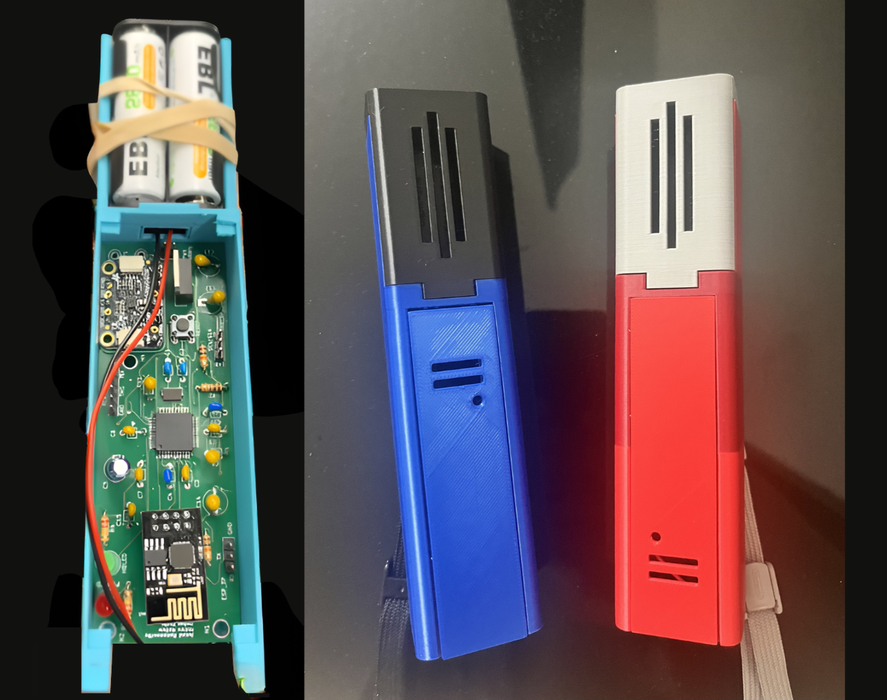

# Just-Dance-
A from-scratch reimagining of the Wii game "Just Dance": custom motion controller hardware (TM4C ARM Cortex-M4, SPI IMU, DAC audio) running on-device ML for real-time dance recognition, with MQTT syncing multiple controllers over Wi-Fi. Group project.
 # TinyML Embedded Gesture Classifier

I built this project with a team of individuals as a real-time embedded gesture-recognition system with a custom PCB using TM4C123 microcontrollers, LSM6DSOX IMUs, ESP8266 wireless communication, and fixed-point TinyML inference.

<p align="center">
  
</p>

<p align="center">
  <em>Custom PCB and handheld controller modules used in the embedded gesture classification system</em>
</p>


The system captures motion from handheld controller modules, segments raw IMU data into meaningful gesture windows, extracts engineered features, runs lightweight classifiers directly on-device, and streams results to a central hub and host display. The full pipeline runs on embedded hardware rather than relying on a PC for inference.

---

## Overview

My goal with this project was to design a complete embedded system capable of classifying human motion under tight hardware constraints.

Each controller:

* samples a 6-axis IMU in real time
* performs filtering and calibration
* segments motion into gesture windows
* extracts a compact feature vector
* classifies gestures using rule-based logic and TinyML models

A central hub coordinates timing, aggregates controller outputs over ESP8266, and forwards results to a PC over UART for visualization.

---

## Key Features

* Real-time gesture classification on TM4C123 microcontrollers
* LSM6DSOX accelerometer/gyroscope integration over I2C
* Deterministic scheduling using a free-running hardware timer
* Fixed 5-second calibration stage for bias stabilization
* Tunable motion segmentation engine
* 32-feature embedded feature extraction pipeline
* Fixed-point TinyML inference (no floating point at runtime)
* Hybrid detection: neural networks + rule-based scoring
* ESP8266 wireless communication between modules
* UART protocol for structured output (`SEG` and `DETECT`)
* EEPROM-backed configuration persistence
* Multi-module embedded architecture (controllers + hub + host)

---

## System Architecture

```text
Controller Modules (TM4C + IMU)
    ↓
Sensor processing + segmentation
    ↓
Feature extraction (32 features)
    ↓
TinyML / rule-based classification
    ↓
ESP8266 wireless messages
    ↓
Central Hub (TM4C)
    ↓
UART output
    ↓
Host PC (Python visualization/logging)
```

A key design decision I made was to keep all classification on the embedded controllers. The PC is only used for visualization and logging, not inference.

---

## Repository Structure

```text
sw/
  sw_Player1_Controller/   → Controller firmware
  sw_Player2_Controller/   → Second controller firmware
  sw_Audio/                → Central hub firmware
  sw_Display/              → Python host interface

hw/                        → KiCad hardware design files
Resources/                 → Datasheets and references
```

### Main Entry Points

* `sw_Player1_Controller/src/Lab1.c`
* `sw_Player2_Controller/sw/src/Lab1.c`
* `sw_Audio/sw/src_latest/Lab5.c`

---

## Embedded Gesture Pipeline

Each controller runs a full embedded ML pipeline:

```text
IMU read
→ axis remap
→ filtering
→ calibration
→ segmentation
→ feature extraction
→ classification
→ output
```

### IMU Processing

I read accelerometer and gyroscope data over I2C and remap axes into a consistent real-world coordinate system:

```text
IRL X = sensor Y  
IRL Y = sensor Z  
IRL Z = sensor X  
```

---

### Calibration

At startup, I run a strict 5000 ms calibration phase using timer-based scheduling. This avoids drift and ensures stable baseline values for bias and gravity compensation.

---

### Real-Time Scheduling

I use Timer0A as a free-running hardware timer and schedule all sampling relative to time instead of loop delays. This keeps behavior deterministic even with UART output or I2C latency.

---

### Motion Segmentation

I designed a segmentation engine that detects meaningful motion using:

* energy thresholds
* quiet-window detection
* min/max segment sizes
* cooldown timing

Each gesture can override segmentation parameters, which makes the system flexible across very different motion types.

---

## Feature Extraction

For each segment, I compute 32 engineered features describing motion shape and intensity.

Examples include:

* duration and sample count
* vertical displacement and total travel
* cross-body movement
* oscillation and slope changes
* total acceleration and gyro energy
* peak timing and normalized feature ratios
* spin characteristics
* energy per sample

Instead of feeding raw time-series data into a large model, I compress each gesture into a compact feature vector to stay within embedded constraints.

---

## TinyML Inference

I implemented small neural networks directly in firmware using fixed-point math.

Typical structure:

```text
16 inputs → 3 hidden (ReLU) → 1 output
```

All weights, biases, and normalization parameters are stored as scaled integers. This avoids floating-point overhead and keeps inference fast and deterministic.

Some gestures use ML models, while others use rule-based scoring depending on how well they can be defined analytically.

---

## Output Protocol

The system outputs structured UART messages:

### Feature Data

```text
SEG,<MOVE>,<32 values>
```

### Final Detection

```text
DETECT,<MOVE>,<score>
```

I use `SEG` for debugging/training and `DETECT` as the final classification output.

---

## Cumulative Scoring

Instead of classifying every segment independently, I accumulate scores across a gesture window and only output a final detection after enough evidence is collected.

This significantly reduces noise and false positives.

---

## Central Hub

The hub is another TM4C system that:

* synchronizes controller start timing
* receives wireless data from controllers
* forwards results over UART
* manages timing-sensitive coordination

---

## Host Interface

I wrote a Python interface using:

* `pyserial` for communication
* `tkinter` for UI
* `opencv` / `Pillow` for visualization

This layer is purely for monitoring—the embedded system performs all classification.

---

## Hardware

This system is built on:

* TM4C123 microcontrollers
* LSM6DSOX IMUs
* ESP8266 modules
* DAC/audio hardware (hub side)
* custom KiCad-designed boards

All hardware files are included in the `hw/` directory.

---

## Why This Project Matters

This project combines:

* real-time embedded systems
* IMU signal processing
* motion segmentation
* feature engineering
* TinyML on constrained hardware
* wireless embedded communication

The most important aspect is that the entire ML pipeline runs **on-device**, making it a true embedded TinyML system rather than a PC-based demo.

---

## Future Improvements

* Modularize controller firmware
* Formalize ML training/export pipeline
* Add evaluation metrics (accuracy, confusion matrix)
* Improve host visualization tools
* Add hardware/system diagrams

---

## Status

This is a working embedded system prototype with real-time gesture classification, multi-device coordination, and on-device ML inference. The core pipeline is fully implemented and functional on embedded hardware.
